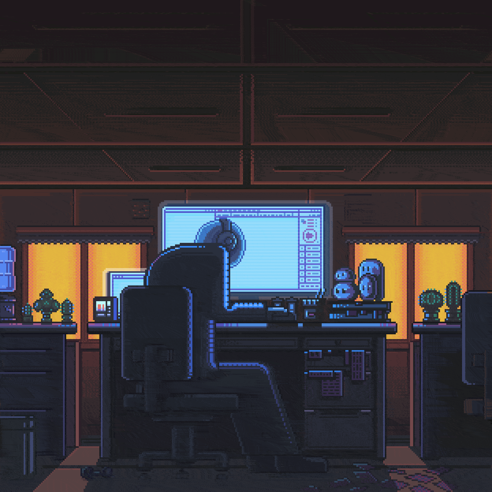
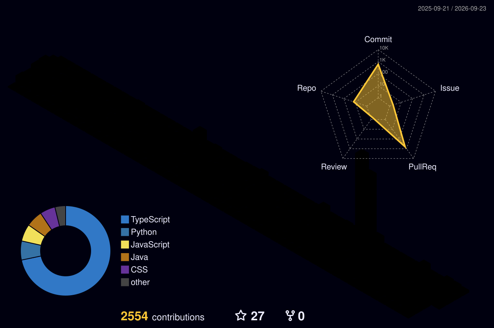

<div align="center">

<!-- ══════════════════════════════════════════════════════════ -->
<!--                   ANIMATED WAVE HEADER                    -->
<!-- ══════════════════════════════════════════════════════════ -->


<!-- ══════════════════════════════════════════════════════════ -->
<!--                   ANIMATED TYPING SVG                     -->
<!-- ══════════════════════════════════════════════════════════ -->
[](https://git.io/typing-svg)

<br/>

<!-- ══════════════════════════════════════════════════════════ -->
<!--                    PROFILE BADGES                         -->
<!-- ══════════════════════════════════════════════════════════ -->
<a href="https://github.com/indhiran08-coder">
  
</a>
<a href="https://github.com/indhiran08-coder?tab=followers">
  
</a>


</div>


---

## 🧠 About Me

```java
public class Developer {

    String  name       = "Indhiran S";
    String  role       = "AI Automation Engineer | Java Backend Developer | Cloud Engineer";
    String  education  = "B.Tech · AI & Data Science · Erode";
    String  location   = "Tamil Nadu, India 🌏";

    String[] workingOn = {
        "N8n Workflow Automation & AI Pipelines",
        "Java Backend APIs with Spring Boot",
        "Cloud Infrastructure & Virtual Machines on AWS"
    };

    String[] interests = {
        "Artificial Intelligence & AI Ethics",
        "Game Engines & Game Development",
        "Cloud-Native & Serverless Architecture"
    };

    String funFact = "I automate tasks so I have more time to game 🎮";

    void sayHi() {
        System.out.println("Thanks for stopping by — let's build something great! 🚀");
    }
}
```

<br/>

<table>
<tr>
<td valign="top" width="55%">

### 🔭 Currently Working On
- **N8n Workflow Automations** & AI pipelines
- Java Backend APIs with **Spring Boot**
- **Cloud Infrastructure** & VM management on AWS

### 🌱 Currently Learning
- **LLMs**, Vector Databases & RAG workflows
- Advanced **System Design** & distributed architecture
- Production-grade **MLOps** & AI agent frameworks

### ⚡ Fun Facts
- I automate tasks so I have more time to game 🎮
- I debug with `System.out.println` and I'm not ashamed
- Turning coffee ☕ into Spring Boot APIs since day one

</td>
<td valign="top" width="45%">



</td>
</tr>
</table>


---

## 🚀 What I Build

<div align="center">

<table>
<tr>
<td align="center" width="33%">
<br/><br/>
<sub>N8n workflows, AI agents & automated pipelines that run while I sleep</sub>
</td>
<td align="center" width="33%">
<br/><br/>
<sub>Spring Boot REST APIs, microservices & cloud-native backend systems</sub>
</td>
<td align="center" width="33%">
<br/><br/>
<sub>AWS deployments, Docker containers, Linux VMs & serverless functions</sub>
</td>
</tr>
</table>

</div>


---

## 🌐 Connect With Me

<div align="center">

<a href="https://www.linkedin.com/in/indhiran-s-36baa0331/" target="_blank">
  
</a>
<a href="https://www.instagram.com/king_indhiran_21/" target="_blank">
  
</a>
<a href="https://github.com/indhiran08-coder" target="_blank">
  
</a>
<a href="https://www.duolingo.com/profile/INDHIRAN%20S" target="_blank">
  
</a>
<a href="mailto:indhiran0fficial04@gmail.com">
  
</a>

</div>


---

## 🛠️ Tech Stack

<div align="center">

**Languages**


<br/>

**Frontend**


<br/>

**Backend & Runtime**


<br/>

**Cloud & DevOps**


<br/>

**AI / ML & Automation**


<br/>

**Tools & Platforms**


&nbsp;


</div>


---

## 📊 GitHub Statistics

<div align="center">


<br/><br/>


</div>


---

## 💬 Random Dev Quote

<div align="center">


</div>


---

## 📈 Contribution Activity


---

## 🌐 3D Contribution Graph

<div align="center">



</div>

<details>
<summary>⚙️ <b>Click to set up the 3D Contribution Graph (GitHub Actions Workflow)</b></summary>

Create `.github/workflows/profile-3d.yml` with this content:

```yaml
name: GitHub-Profile-3D-Contrib

on:
  schedule:
    - cron: "0 18 * * *"   # Runs every day at midnight IST
  workflow_dispatch:
  push:
    branches:
      - main

jobs:
  build:
    runs-on: ubuntu-latest
    name: generate-github-profile-3d-contrib
    steps:
      - uses: actions/checkout@v3
      - uses: yoshi389111/github-profile-3d-contrib@0.7.1
        env:
          GITHUB_TOKEN: ${{ secrets.GITHUB_TOKEN }}
          USERNAME: ${{ github.repository_owner }}
      - name: Commit & Push
        run: |
          git config user.email "action@github.com"
          git config user.name "GitHub Action"
          git add -A .
          git commit -m "generate 3D contribution graph" || exit 0
          git push
```

> After setup, run the workflow manually once from the **Actions** tab to generate the image.

</details>


---

## 🐍 Contribution Snake

<picture>
  <source media="(prefers-color-scheme: dark)" srcset="https://raw.githubusercontent.com/indhiran08-coder/indhiran08-coder/output/github-contribution-grid-snake-dark.svg" />
  <source media="(prefers-color-scheme: light)" srcset="https://raw.githubusercontent.com/indhiran08-coder/indhiran08-coder/output/github-contribution-grid-snake.svg" />
  
</picture>

<details>
<summary>⚙️ <b>Click to set up the Snake Animation (GitHub Actions Workflow)</b></summary>

Create the file `.github/workflows/snake.yml` in your profile repository with this content:

```yaml
name: Generate Snake Animation

on:
  schedule:
    - cron: "0 */12 * * *"   # Runs every 12 hours
  workflow_dispatch:
  push:
    branches:
      - main

jobs:
  generate:
    permissions:
      contents: write
    runs-on: ubuntu-latest
    timeout-minutes: 5

    steps:
      - name: Generate github-contribution-grid-snake.svg
        uses: Platane/snk/svg-only@v3
        with:
          github_user_name: ${{ github.repository_owner }}
          outputs: |
            dist/github-contribution-grid-snake.svg
            dist/github-contribution-grid-snake-dark.svg?palette=github-dark

      - name: Push snake SVG to output branch
        uses: crazy-max/ghaction-github-pages@v3.1.0
        with:
          target_branch: output
          build_dir: dist
        env:
          GITHUB_TOKEN: ${{ secrets.GITHUB_TOKEN }}
```

</details>


---

## 🏅 Certifications & Recognition

<div align="center">

<!-- Add your actual certifications below -->
<a href="https://github.com/indhiran08-coder/indhiran08-coder/blob/main/certifications/AWS-Certified-Cloud-Practitioner.pdf" target="_blank">
  
</a>


<br/><br/>

**🌐 Currently Exploring**


</div>


---

## 🦜 Duolingo

<div align="center">

<a href="https://www.duolingo.com/profile/INDHIRAN%20S">
  
</a>

</div>

---

<div align="center">

### 💌 Let's Connect & Collaborate

I'm always open to interesting conversations, collaborations, and exciting opportunities.
Whether it's an AI project, a backend challenge, or just a tech chat — reach out!

📧 **[indhiran0fficial04@gmail.com](mailto:indhiran0fficial04@gmail.com)**

<br/>

*"Automate the mundane, architect the future — intelligence at every layer."*

<br/>


</div>

<!-- LAST_UPDATED: 2026-08-20 -->
